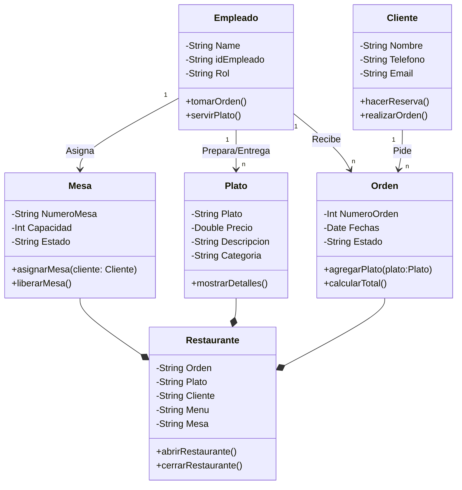

# Poo-Reto-2: Diagrama UML
Para la solución de este reto, decidí plantear los componentes de un restaurante, y las relaciones existentes entre estos, incluyendo a los empleados y a los clientes. A continuación el diagrama: 

